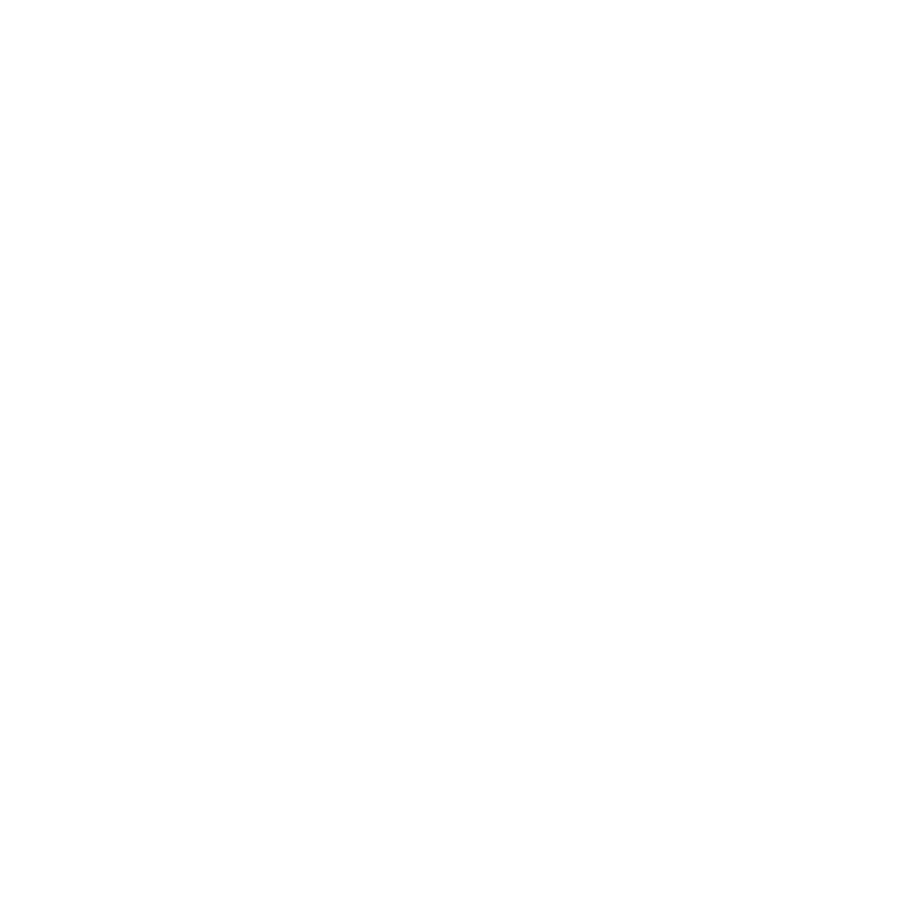
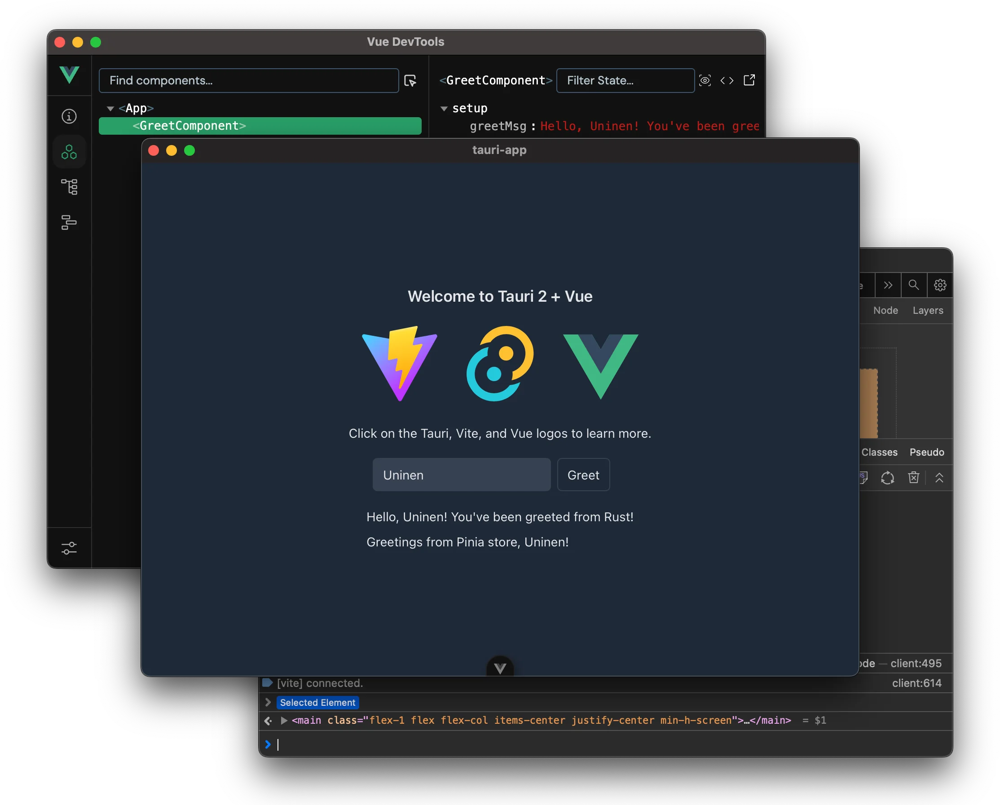

# ImmediateEarth



ImmediateEarth是一款动态壁纸应用，能够实时抓取向日葵8号卫星拍摄的地球图像，经过艺术化处理后设置为桌面壁纸。软件设计注重用户体验，采用后台涓流下载技术，自动根据系统资源使用情况调整运行策略，实现低资源占用与优质视觉体验的平衡。
是[让地球的实时美丽照片显示在你的Mac桌面上丨即刻地球](https://sspai.com/post/48278)的实现， 原软件已不可用，本人非常喜欢，所以复刻本软件。

## 核心功能

- **实时卫星图像**：每30分钟自动更新来自向日葵8号卫星的地球图像
- **智能图像处理**：根据太阳照射角度和时间自动调整图像布局和渲染效果
- **多显示器支持**：自动识别并适配多显示器配置，为每个屏幕提供最佳显示效果
- **系统资源优化**：根据CPU和内存使用情况智能调整更新频率和渲染时机
- **离线支持**：无网络连接时自动使用缓存图像或预设壁纸
- **低带宽占用**：采用瓦片式涓流下载技术，最小化网络资源消耗
- **天气信息集成**：显示当前位置天气信息，与地球图像联动

## 技术架构

### 前端 (WebView 进程)

- **框架**：Vue 3 + TypeScript
- **构建工具**：Vite
- **UI框架**：Tailwind CSS
- **状态管理**：Pinia
- **主要组件**：
  - `SatelliteImageComponent.vue`：主界面组件，负责图像显示和用户交互
  - 响应式设计，适配不同屏幕尺寸

### 后端 (核心进程)

- **框架**：Tauri (Rust)
- **主要功能模块**：
  - 卫星图像下载与拼接 (`src-tauri/src/lib.rs`)
  - 图像处理与裁剪 (`src-tauri/src/lib.rs`)
  - 跨平台壁纸设置 (`src-tauri/src/wallpaper.rs`)
  - 系统资源监控与优化

### 数据流程

1. 定期从Himawari-8卫星服务器下载图像瓦片
2. 拼接瓦片生成完整地球图像
3. 根据时间和太阳位置进行艺术化处理
4. 针对不同显示器分辨率裁剪图像
5. 通过系统API设置为桌面壁纸
6. 清理旧图像，管理缓存

## 安装指南

### 前提条件

- [Tauri开发环境依赖](https://tauri.app/start/prerequisites/)
- Node.js (v16+)
- Rust (1.60+)
- pnpm (推荐)

### 构建步骤

1. 克隆仓库

```bash
git clone https://github.com/yourusername/ImmediateEarth.git
cd ImmediateEarth
```

2. 安装依赖

```bash
pnpm install
```

3. 开发模式运行

```bash
pnpm tauri dev
```

4. 构建生产版本

```bash
pnpm tauri build
```

构建产物将位于`src-tauri/target/release/bundle`目录下。

## 使用方法

### 基本操作

1. 启动应用后，点击"获取地球图像"按钮手动更新卫星图像
2. 在"设置"标签页中配置自动更新选项
3. 选择要设置壁纸的显示器
4. 点击"为选中屏幕设置壁纸"应用当前图像

### 自动更新

- 勾选"自动定时更新并设置壁纸"启用自动模式
- 应用将每30分钟自动更新图像并应用到选中的显示器

### 高级设置

- **OpenWeather Key**：配置天气信息API密钥以启用天气显示功能
- **城市设置**：手动输入或自动获取城市位置
- **清理旧图片**：手动触发缓存清理

## 项目结构

```
ImmediateEarth/
├── src/                  # 前端源代码
│   ├── components/       # Vue组件
│   ├── assets/           # 静态资源
│   └── ...
├── src-tauri/            # Tauri后端源代码
│   ├── src/              # Rust代码
│   ├── Cargo.toml        # Rust依赖配置
│   └── tauri.conf.json   # Tauri应用配置
├── package.json          # 前端依赖配置
└── README.md             # 项目文档
```

## 技术细节

### 图像处理

应用根据以下因素动态调整图像：

- **太阳位置**：根据日本时间自动调整图像裁剪区域
- **屏幕比例**：保持地球图像正确比例，避免拉伸变形
- **时间因素**：凌晨和下午采用不同的图像处理策略

### 跨平台实现

- **Windows**：使用`SystemParametersInfoW` API和注册表修改实现壁纸设置
- **macOS**：通过AppleScript调用系统接口
- **Linux**：支持GNOME和KDE桌面环境

## 数据来源

地球卫星图像来自日本气象厅向日葵8号卫星(Himawari-8)，通过[himawari.asia](https://himawari.asia)提供的API获取。

## 许可证

本项目采用MIT许可证 - 详情参见[LICENSE](LICENSE)文件。

## 贡献指南

欢迎贡献代码、报告问题或提出建议。请遵循以下步骤：

1. Fork本仓库
2. 创建特性分支 (`git checkout -b feature/amazing-feature`)
3. 提交更改 (`git commit -m 'Add some amazing feature'`)
4. 推送到分支 (`git push origin feature/amazing-feature`)
5. 打开Pull Request

## 致谢

- 日本气象厅提供的卫星图像数据
- Tauri、Vue.js和Rust社区提供的优秀工具和框架

# Tauri + Vue + Vite 模板



完全配置好的 Tauri 和 Vue 3（带 TypeScript）项目模板，并集成 CI 工具。

## 功能特性

- **Vue 3 (TypeScript)** 前端（支持开发工具）
- **Vite** 配置了 [AutoImport 插件](https://github.com/antfu/unplugin-auto-import)
- **Vitest** 用于单元测试
- **Github Actions** 实现自动化测试和 CI 流水线
- **VS Code** 推荐插件和调试配置

## 环境搭建

1. 安装 [Tauri 开发环境依赖](https://tauri.app/start/prerequisites/)
2. 克隆项目并安装依赖（本模板默认使用 `pnpm`）：

```sh
pnpm i
```

## 使用说明

一个 Tauri 应用至少包含两个进程：

- 核心进程 (`backend`，也叫 _main_ 进程，Electron 的术语)
- WebView 进程 (`frontend`，也叫 _renderer_ 进程)

### 🦢 前端 (TS, PnPM)

#### 启动开发服务器

前后端可以通过一条命令同时启动：

```sh
pnpm tauri dev
```

#### 执行测试

```sh
pnpm test
```

### 🦀 后端 (Rust, Cargo)

后端代码位于 `src-tauri/` 目录下（以下命令应在此目录中执行）

#### 查看过期的 Rust 依赖

如果你安装了 [cargo-outdated](https://github.com/kbknapp/cargo-outdated)：

```sh
cargo outdated
```

#### 升级 Rust 依赖

如果你安装了 [cargo-edit](https://github.com/killercup/cargo-edit)：

```sh
cargo upgrade
```

### 调试

- 默认 `dev` 命令设置了 `RUST_BACKTRACE=1`，这会让 Rust 输出完整的错误堆栈到控制台。（如果你不需要它，可以从 [package.json](file://c:\Users\YiranzaiHWin\Documents\GitHub\ImmediateEarth\package.json) 的命令中移除它）
- 如果你使用 VS Code，可以使用内置的 `Debug Tauri` 配置来调试 Rust 代码。

### 构建与发布

#### 构建

项目已集成了 GitHub Actions，每次提交或 PR 都会自动测试和构建你的应用。也可以手动构建：

```sh
pnpm tauri build
```

#### 发布新版本

1. 通过运行 `pnpm bump [x.y.z]` 来升级版本号
2. 运行 `pnpm check` 更新 [Cargo.lock](file://c:\Users\YiranzaiHWin\Documents\GitHub\ImmediateEarth\src-tauri\Cargo.lock)
3. 为你要发布的 commit 添加标签 `vX.Y.Z`
4. 编辑发布说明并推送到远程（包括标签！）
5. GitHub 工作流将自动生成一个新的草稿版本。准备就绪后发布🎉

## 其他信息

- 关注 [unessa.net on Bluesky](https://bsky.app/profile/uninen.net) 或 [@uninen on Twitter](https://twitter.com/uninen)
- 阅读我在 Tauri / Vue / TypeScript 和其他 Web 开发主题上的学习记录，请访问我的 [Today I Learned 网站](https://til.unessa.net/)

## 贡献指南

欢迎贡献！请在与其他开发者互动时遵循 [行为准则](./CODE_OF_CONDUCT.md)。
